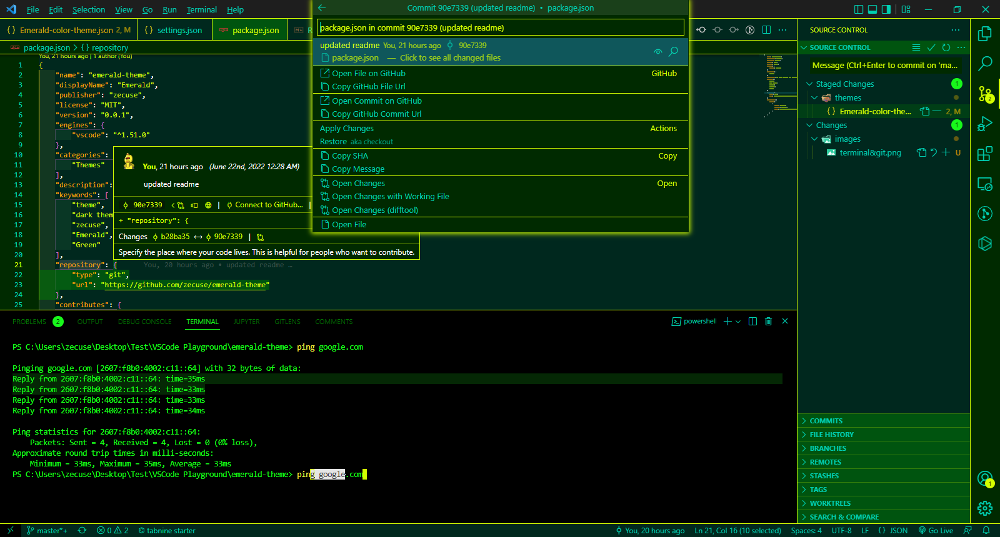
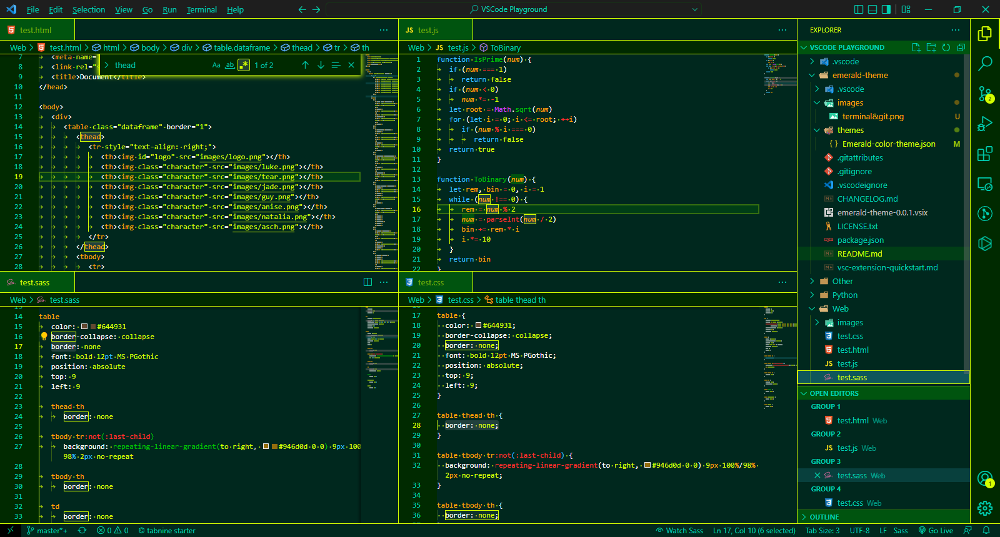
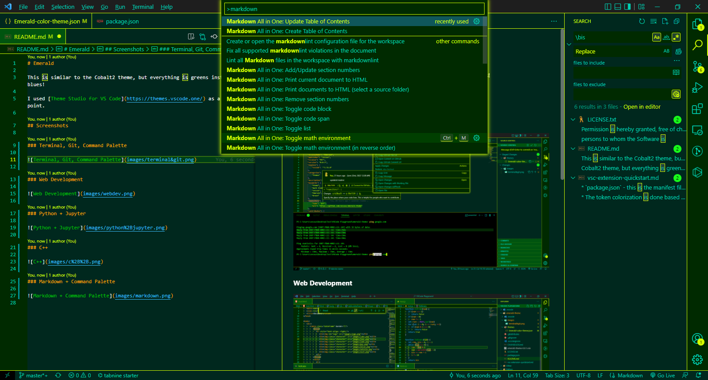

# Emerald

This is similar to the Cobalt2 theme, but everything is greens instead of blues!

I used [Theme Studio for VS Code](https://themes.vscode.one/) as a starting point to make the theme.

## Screenshots

### Terminal, Git, Command Palette

### Web Development

### Python + Jupyter

### C++

### Markdown + Command Palette

